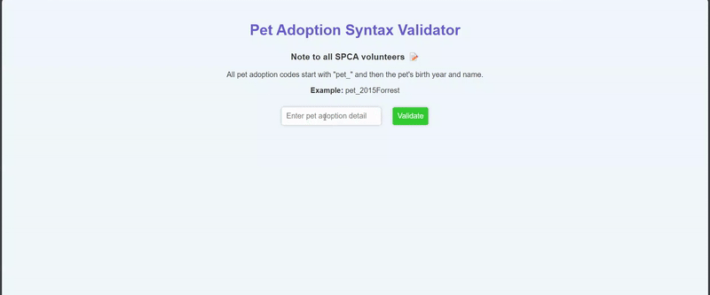

### INNRAN532_BCL2401_GroupB_InnocentRangaka_JSL01

# Syntax Validation for Pet Input

Providing basic syntax validation for user-entered pet code in "pet_<YEAR><PET_NAME>" format using regular expressions to validate different parts of the pet code format. Based on combined prefix, year, and pet name validations, suitable text messages and CSS classes get assigned for the overall outcome.

## Functionality

* Retrieves user input from an element with the ID petInput;
* Checks if the input follows a specific format likely resembling "pet_<YEAR><PET_NAME>";
* Validates the presence of the prefix "pet_";
* Validates the year format (starting with 19 or 20 followed by two digits between 1900 and 2099);
* Validates the pet name format (starting with an uppercase letter, and many contain letters and numbers);
* Provides informative feedback through a displayed message ("Valid Syntax" or "Invalid Syntax");
* Updates the validation status visually using CSS classes ("valid" or "invalid");

## Usage

* Enter the pet code on an input element with the ID petInput.
* Click "validate" button to validate the entered pet code.
* The validation message will be displayed on an element with the ID result below the input and button elements.

## Technologies

* HTML
* CSS
* JS
* VS Code
